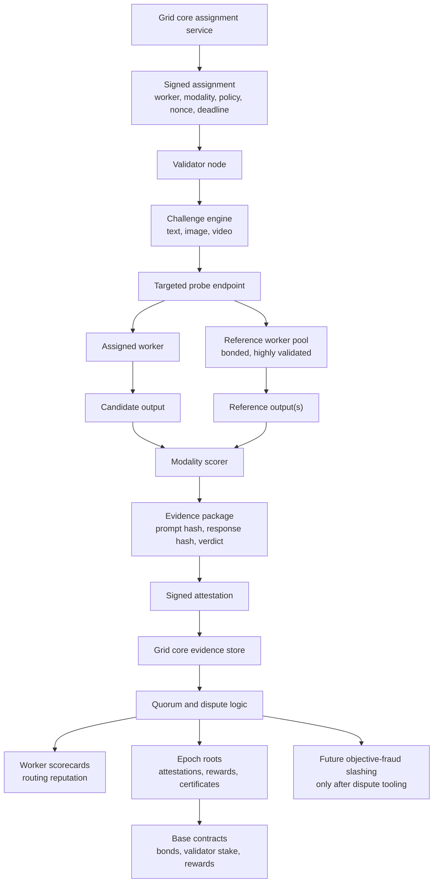

# AIPG Validator Node Design

Validator nodes are the Grid's quality, honesty, and provenance layer. They are
not a magic proof that a remote machine is running a specific private stack. They
are a distributed way to measure whether workers deliver the capability they
claim, follow job parameters, and deserve more trust.

The first public version should be deliberately low-authority:

> easy to run, useful evidence, no slashing power.

For the practical build sequence and release gates, see [ROADMAP.md](ROADMAP.md).
The accepted on-chain and trusted-partner Core sequence lives in
[`grid-core/docs/architecture/DECENTRALIZATION_ROADMAP.md`](https://github.com/AIPowerGrid/grid-core/blob/main/docs/architecture/DECENTRALIZATION_ROADMAP.md);
the public node must not independently invent an economic or federation
protocol.

## Phases

### V0: Distributed Audit Runner

Status: current repo direction.

- Source install with `init`, `check`, and `run`.
- GitHub Release binary installer scaffold.
- Linux systemd installer scaffold for always-on operation.
- Editable package install with the `aipg-validator` console command.
- Module entrypoint for `python -m validator`.
- Local Docker image and Compose definitions.
- CI for compile, unit tests, CLI smoke, Docker build, and release-binary build
  scaffolding.
- Read-only local dashboard on `127.0.0.1:8790`.
- CPU-only.
- Mandatory linked-wallet registration and assignment-bound text canaries.
- Mandatory signed registration, heartbeat, and attestations.
- Candidate Core implements capabilities, worker discovery, assignments,
  targeted text probes, attestations, scorecards, assignment health, and
  non-economic shared 3-of-5 quorum states. Production remains gated on migration
  `0024`, immutable deployment, and endpoint smoke tests. Independent operator
  control is not proven by registration alone.
- Missing required validator endpoints fail closed; read-only metadata may
  degrade gracefully.
- No rewards, routing effects, strikes, or slashing. Targeted attribution is
  evidence-only.
- Outputs inform dashboards and implementation work.

### V1: Routing Signal (Future Economic Authority)

- Build on the existing assignment/attestation/scorecard path.
- Prove multi-validator agreement and self-validation exclusion operationally.
- Routing begins to use scores cautiously.
- Still no slashing from public validators.

### V2: Capability Certification

- Text capability probes: JSON, code, tool use, long context, max-token honesty.
- Image probes: prompt adherence, parameter honesty, deterministic workflow checks.
- Video probes: duration, fps, motion, keyframe consistency.
- Bonded high-trust workers can enter a reference pool.
- Deterministic workflow certificates prove reproducible provenance for product
  layers that need it. Minting policy, marketplace policy, and user experience
  decisions stay outside the validator node.

### V3: Economic Validation

- Validator staking on Base.
- Validator rewards for accepted attestations.
- Epoch roots anchored on-chain.
- Objective fraud can be slashable through quorum and dispute processes.

## Validator Data Flow

This is the target flow. V0 implements registration, shared Grid-issued probe
groups, targeted worker execution, signed evidence, and evidence-only 3-of-5 quorum.
Anything that affects routing, rewards, or slashing must additionally wait for
independently operated validators and a dispute process.



Base should anchor compact roots, rewards, bonds, stake, and dispute outcomes.
Raw prompts, raw outputs, answer keys, pHashes, private thresholds, and live
challenge seeds should stay off-chain and out of the public repo.

## Validation Lanes

### Proof Of Usefulness

For text, general image, and general video jobs.

The question is: did the worker produce a useful result for the advertised
capability tier?

Examples:

- text worker solves generated code/math/tool-use tasks
- image worker follows object count, dimensions, and prompt constraints
- video worker returns real motion, correct length, and expected resolution

This should primarily affect routing and reputation.

### Proof Of Fidelity

For deterministic workflows.

The question is: did the worker reproduce an approved workflow within tolerance?

For image workflows this can use:

- workflow hash
- model/checkpoint hash
- VAE/LoRA/control model hashes
- sampler, scheduler, steps, CFG, dimensions
- explicit seed behavior
- pHash, SSIM, LPIPS, and metadata checks

This lane should certify reproducible workflow provenance. A product may later
choose to require that certificate for NFT minting, marketplace badges, or
other high-trust actions, but the validator node does not decide mint policy.

> Validators certify reproducibility; product layers decide which certified
> workflows are eligible for product-specific actions.

### Proof Of Honesty

For every modality.

The question is: did the worker follow the job contract?

Examples:

- respects explicit seed
- respects max tokens or media dimensions
- returns valid JSON when requested
- does not claim completion without usable output
- signs receipts correctly
- does not return cached unrelated output
- reports failures honestly

Objective dishonesty is the future slashing surface. Subjective quality should
downgrade routing, not slash.

## Worker Trust Levels

Bonding gives a worker economic skin in the game. Validation determines how much
trust that worker earns.

| Level | Meaning |
|---|---|
| Unbonded | low-risk testing or very limited traffic |
| Bonded | normal paid jobs with caps |
| Validated | higher routing and payout caps |
| Certified | approved deterministic workflow access |
| Reference | high-trust baseline worker used for comparisons |

Bond should raise the trust ceiling. It should not replace validation.

## Reference Pool

Some bonded, highly validated workers can become reference workers. Validators use
them to produce baselines for candidate workers.

Flow:

```text
challenge generator
  -> reference worker result(s)
  -> candidate worker result
  -> modality scorer
  -> signed validator attestation
  -> worker score / certification state
```

Rules:

- avoid a single reference oracle
- use quorum for important certifications
- throw out ambiguous reference disagreements
- rotate reference workers
- never reveal live challenge answers in the public binary

Reference workers are strongest for deterministic image workflows. For text, use
objective verifiers first and reference answers only as supporting evidence.

## Probe Lifecycle

Current V0 lifecycle:

1. Load config from `.env`.
2. Register the linked signing wallet and advertised capabilities.
3. Optionally check local stake configuration; preview requires no stake.
4. Fetch assignments from the Grid.
5. Submit the assignment through the validator-only targeted endpoint.
6. Match the returned assignment, worker, model, nonce, and capability; then
   recompute the prompt, response, and canonical evidence hashes.
7. Score the result locally as `healthy`, `slow`, or `failed` against Core's
   expected-answer commitment. Core does not return its private verdict.
8. Sign the probe group, assignment id, Grid nonce, verified evidence hash, and local verdict.
9. Persist the signed envelope in the private local outbox, then submit it.
   Retry delivery before new work and delete only after Core accepts it.
10. Heartbeat between rounds.
11. Core stores non-economic evidence and updates shared 3-of-5 quorum scorecards.

The shared-quorum protocol assigns one challenge family to multiple registered
validators. Evidence still cannot influence routing or money until those nodes
are proven independently operated and a dispute process exists.

## Text Validation

Current V0 checks:

- exact nonce echo
- generated arithmetic QA
- strict JSON object compliance
- randomized context retrieval at calibrated 4K, 16K, and 32K tiers
- generated multistep integer logic
- Python function synthesis interpreted over a bounded arithmetic AST against
  assignment-only hidden inputs; worker code is never executed
- exact randomized single-function calls
- exact randomized two-stage tool-call chains
- randomized stop-sequence compliance
- latency classification

Planned checks:

- richer JSON Schema constraints
- code and logic capability tiers
- larger 64K+ long-context retrieval tiers
- longer tool-call chains
- streaming integrity

Prefer objective checks. Use LLM-as-judge only as a supporting signal.

## Image Validation

The accepted Core execution and trust-boundary specification is
`grid-core/docs/architecture/MEDIA_VALIDATION_V1.md`. This section summarizes
the modality policy; it does not authorize the existing local scaffold as
assignment-bound evidence.

General image validation:

- output decodes
- dimensions and format match
- not blank or pure noise
- prompt constraints are plausibly followed
- explicit seed behavior is honored where claimed

The validator now has an assignment-loop-wired, fail-closed witness fetch boundary: exact
operator-configured public HTTPS origins, redirects/proxies/content encodings
disabled, bounded time and bytes, MIME/length binding, and SHA-256
recomputation. The node advertises image fidelity only when its optional media
dependencies and origin allowlist are ready. Core issuance remains disabled
until deterministic recipes, independent bonded references, immutable witness
retention, and rollout gates are complete. A dark
`image.fidelity.v1` scorer independently checks dimensions and structure,
requires two committed references to agree, and only then fails a candidate
pHash outlier. Unsafe transport, unavailable decoders, malformed contracts, or
reference disagreement are inconclusive.

Deterministic workflow validation:

- same workflow
- same seed
- same params
- compare against certified reference output
- pHash/SSIM/LPIPS within tolerance

This is where the network can get close to proof-of-fidelity.

## Video Validation

The source validator now has a dark, assignment-loop-wired video scorer.
Production Core contains the matching separately gated, default-off
`video.contract.v1` assignment and hard-targeted witness path, but video
issuance is not enabled; the public V0 binary also does not bundle PyAV. The
scorer fetches only hash-bound witnesses
from explicit public HTTPS origins and decodes each untrusted MP4/WebM object in a
killable child process with time, frame, dimension, and Linux resource bounds.
Witnesses are decoded sequentially to bound peak native memory. A local decode
timeout is inconclusive; malformed candidate bytes are a worker failure only
after the authenticated witness commitment verifies.

Implemented `video.contract.v1` checks:

- output decodes
- duration/fps/resolution match
- frame count and timestamps are coherent
- frames are not just a static still
- blank frames fail
- latency is classified

Implemented `video.fidelity.v1` checks add two distinct reference workers:

- both references must satisfy the same contract and agree first
- every decoded frame's pHash is compared within a configured tolerance
- consecutive-frame pHash distances form a lightweight motion profile
- candidate/reference mismatch fails only after the references agree

The current motion profile is deliberately CPU-light; it is not optical flow.
Prompt relevance, direction, and key-event matching remain future supporting
signals and must not be claimed from this scorer.

Core assignment generation, targeted media execution, immutable witness
retention, real-workload calibration, and cross-platform media-enabled binary
qualification remain rollout gates. Video evidence should start as routing
evidence, not a slashing surface.

## Attestations

Attestations should be deterministic, signed, and hashable. The wire form sent
to Grid core is an envelope: `{ "payload": { ...canonical fields... },
"signature": "0x..." }`. In unsigned V0 preview mode, `signature` is `null`.

Current V0 text payload shape:

```json
{
  "validator": "0x...",
  "attestation_schema": "aipg.validator.attestation.v0",
  "assignment_id": "validator-v0:...",
  "assignment_source": "validator_v0",
  "grid_nonce": "",
  "epoch": "2026062614",
  "worker_id": "",
  "model": "qwen3-27b",
  "modality": "text",
  "capability": "text.basic.v0",
  "canary_kind": "echo",
  "nonce": "A1B2C3D4",
  "evidence_schema": "aipg.validator.evidence.v0",
  "prompt_hash": "sha256...",
  "response_hash": "sha256...",
  "evidence_hash": "sha256...",
  "verdict": "healthy",
  "score": 1.0,
  "latency_ms": 3200,
  "ts": 1782470000
}
```

V0 assignment ids are validator-generated and explicitly marked
`assignment_source=validator_v0`; they are not proof of Grid assignment or
worker attribution. Targeted/economic phases must require Grid-issued
assignment ids and nonces, then add modality-specific evidence fields.

The public repo can contain the attestation format and scoring engines. It must
not contain live answer keys, static private challenge prompts, golden pHashes,
live scoring secrets, or private policy thresholds. Public default tolerances are
fine for local preview scorers; production assignment policies should be
versioned and rotated from the Grid side.

## Grid Dependencies

V0 discovers Grid validator feature flags through:

- `GET /v1/validator/capabilities`

Required identity and assignment endpoints are:

- `POST /v1/validator/register`
- `GET /v1/validator/registration`
- `POST /v1/validator/heartbeat`
- `GET /v1/validator/assignments`
- `POST /v1/validator/probe/{assignment_id}`
- `POST /v1/validator/attest`

Read-only operator endpoints are:

- `GET /v1/validator/scorecards`
- `GET /v1/validator/workers`
- `GET /v1/validator/assignments/health`

Required endpoint failure is an unavailable validator round, never a public
inference fallback and never a worker failure.

## On-Chain Path

Base should not receive raw prompts or outputs. The chain should get compact,
auditable commitments:

- validator registry
- validator stake
- worker bond/slash events
- workflow certificate roots
- epoch attestation roots
- reward distribution roots

Raw evidence stays off-chain unless needed for a dispute.

## Rewards And Slashing

Not live in V0.

Future reward model:

```text
reward =
  base_fee
  * difficulty_weight
  * modality_weight
  * agreement_score
  * timeliness
  * validator_reputation
```

Do not pay for mere presence. Pay for accepted, useful, timely attestations.

Future slashing should be limited to objective fraud:

- forged receipts
- signing impossible results
- repeated explicit seed dishonesty
- deterministic workflow mismatch after certification
- fake completions
- challenge leakage or collusion

Going offline should stop rewards, not slash stake.

## Status

- [x] Node scaffold.
- [x] V0 text prober.
- [x] Capability-gated exact instruction, arithmetic, strict JSON, context
  retrieval, multistep logic, restricted-AST code synthesis,
  single-function-call, two-stage tool-chain, stop-sequence, and gross
  token-limit scorers.
- [x] Operator CLI.
- [x] Release binary installer scaffold.
- [x] Linux systemd installer scaffold.
- [x] Package metadata and console script.
- [x] Module entrypoint for source/binary packaging.
- [x] Local read-only status dashboard.
- [x] Local Dockerfile and Compose packaging.
- [x] GitHub Actions CI for package/test/CLI/Docker build.
- [x] GitHub Actions release-binary workflow scaffold.
- [x] Mandatory signed registration and attestations.
- [x] Core-side validator capability, attestation, scorecard, worker-inventory,
  assignment, and targeted-probe implementation with tests.
- [x] Image/video scoring design and dark validator-side video contract/fidelity scorer.
- [x] Dev-manager roadmap and go/no-go boundaries.
- [x] Cross-platform binary packaging and build-only release qualification.
- [ ] Publish Docker image on release.
- [x] Grid validator assignment endpoint.
- [ ] Deploy migrations through `0024` and the immutable Core candidate to production.
- [ ] Prove registration, assignment, targeted-probe, attestation, and scorecard
  endpoints against production.
- [x] `POST /v1/validator/probe/{assignment_id}` targeted text execution.
- [x] Assignment health, scorecards, and non-economic evidence lifecycle.
- [x] Shared-challenge distinct-validator 3-of-5 quorum implementation and tests.
- [x] Remove fixed public media seeds and round-index prompt selection from the
  local scaffold; authoritative media challenges remain Core-issued future work.
- [ ] Media/video probe loop activation: validator-side polling and scoring are
  implemented dark; Core issuance/execution and production calibration remain disabled.
- [x] Informational worker/model scorecards in core.
- [x] Console validator evidence scorecards in current workspace.
- [ ] Validator staking contract.
- [ ] Validator rewards.
- [ ] Epoch roots on Base.
