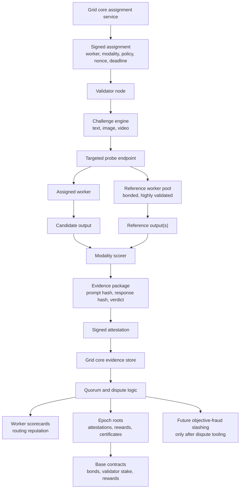

# AIPG Validator Node Design

Validator nodes are the Grid's quality, honesty, and provenance layer. They are
not a magic proof that a remote machine is running a specific private stack. They
are a distributed way to measure whether workers deliver the capability they
claim, follow job parameters, and deserve more trust.

The first public version should be deliberately low-authority:

> easy to run, useful evidence, no slashing power.

For the practical build sequence and release gates, see [ROADMAP.md](ROADMAP.md).

## Phases

### V0: Distributed Audit Runner

Status: current repo direction.

- Source install with `init`, `check`, and `run`.
- GitHub Release binary installer scaffold.
- Linux systemd installer scaffold for always-on operation.
- Editable package install with the `aipg-validator` console command.
- Module entrypoint for `python -m validator`.
- Local Docker image and Compose definitions.
- CI for compile, unit tests, CLI smoke, Docker build, and release-binary build
  scaffolding.
- Read-only local dashboard on `127.0.0.1:8790`.
- CPU-only.
- Model-routed text canaries through normal Grid APIs.
- Best-effort signed attestations.
- Core-side `GET /v1/validator/capabilities` is implemented in the current
  Grid core V0 worktree so nodes can discover safe feature flags.
- Core-side `POST /v1/validator/attest` evidence storage is implemented in the
  current Grid core V0 worktree; deployment/use is a rollout step.
- Core-side `GET /v1/validator/scorecards` aggregate evidence view is
  implemented in the current Grid core V0 worktree; it is informational only.
- Core-side `GET /v1/validator/workers` inventory is implemented in the current
  Grid core V0 worktree, but returns `targeted_probe_enabled=false`.
- Missing validator endpoints degrade gracefully.
- No rewards, no slashing, no targeted worker attribution.
- Outputs inform dashboards and implementation work.

### V1: Routing Signal

- Grid exposes validator assignments and an attestation sink.
- Validators receive signed assignments from the Grid.
- Attestations update worker scorecards.
- Routing begins to use scores cautiously.
- Still no slashing from public validators.

### V2: Capability Certification

- Text capability probes: JSON, code, tool use, long context, max-token honesty.
- Image probes: prompt adherence, parameter honesty, deterministic workflow checks.
- Video probes: duration, fps, motion, keyframe consistency.
- Bonded high-trust workers can enter a reference pool.
- Deterministic workflow certificates prove reproducible provenance for product
  layers that need it. Minting policy, marketplace policy, and user experience
  decisions stay outside the validator node.

### V3: Economic Validation

- Validator staking on Base.
- Validator rewards for accepted attestations.
- Epoch roots anchored on-chain.
- Objective fraud can be slashable through quorum and dispute processes.

## Validator Data Flow

This is the target flow for validators once the Grid supports assignments and
targeted probes. V0 only runs the left edge of this flow as evidence-only,
model-routed canaries; anything that affects routing, rewards, or slashing must
wait for Grid-issued assignments, targeted worker execution, evidence hashes,
and quorum.



Base should anchor compact roots, rewards, bonds, stake, and dispute outcomes.
Raw prompts, raw outputs, answer keys, pHashes, private thresholds, and live
challenge seeds should stay off-chain and out of the public repo.

## Validation Lanes

### Proof Of Usefulness

For text, general image, and general video jobs.

The question is: did the worker produce a useful result for the advertised
capability tier?

Examples:

- text worker solves generated code/math/tool-use tasks
- image worker follows object count, dimensions, and prompt constraints
- video worker returns real motion, correct length, and expected resolution

This should primarily affect routing and reputation.

### Proof Of Fidelity

For deterministic workflows.

The question is: did the worker reproduce an approved workflow within tolerance?

For image workflows this can use:

- workflow hash
- model/checkpoint hash
- VAE/LoRA/control model hashes
- sampler, scheduler, steps, CFG, dimensions
- explicit seed behavior
- pHash, SSIM, LPIPS, and metadata checks

This lane should certify reproducible workflow provenance. A product may later
choose to require that certificate for NFT minting, marketplace badges, or
other high-trust actions, but the validator node does not decide mint policy.

> Validators certify reproducibility; product layers decide which certified
> workflows are eligible for product-specific actions.

### Proof Of Honesty

For every modality.

The question is: did the worker follow the job contract?

Examples:

- respects explicit seed
- respects max tokens or media dimensions
- returns valid JSON when requested
- does not claim completion without usable output
- signs receipts correctly
- does not return cached unrelated output
- reports failures honestly

Objective dishonesty is the future slashing surface. Subjective quality should
downgrade routing, not slash.

## Worker Trust Levels

Bonding gives a worker economic skin in the game. Validation determines how much
trust that worker earns.

| Level | Meaning |
|---|---|
| Unbonded | low-risk testing or very limited traffic |
| Bonded | normal paid jobs with caps |
| Validated | higher routing and payout caps |
| Certified | approved deterministic workflow access |
| Reference | high-trust baseline worker used for comparisons |

Bond should raise the trust ceiling. It should not replace validation.

## Reference Pool

Some bonded, highly validated workers can become reference workers. Validators use
them to produce baselines for candidate workers.

Flow:

```text
challenge generator
  -> reference worker result(s)
  -> candidate worker result
  -> modality scorer
  -> signed validator attestation
  -> worker score / certification state
```

Rules:

- avoid a single reference oracle
- use quorum for important certifications
- throw out ambiguous reference disagreements
- rotate reference workers
- never reveal live challenge answers in the public binary

Reference workers are strongest for deterministic image workflows. For text, use
objective verifiers first and reference answers only as supporting evidence.

## Probe Lifecycle

V0 lifecycle:

1. Load config from `.env`.
2. Optionally check local stake configuration.
3. List models from `/v1/models`.
4. Filter out names that look like media models.
5. Submit text canaries through `/v1/chat/completions`.
6. Score response as `healthy`, `slow`, or `failed`.
7. Build an attestation with assignment metadata, epoch, and evidence hashes;
   optionally sign it.
8. Submit the attestation if `/v1/validator/attest` exists.

Future targeted lifecycle:

1. Fetch signed assignments from the Grid.
2. Submit probe to a specific worker through a validator-only endpoint.
3. Score the result using the assigned modality scorer.
4. Sign the attestation.
5. Grid stores evidence and updates worker scorecards.
6. Epoch scoring computes validator rewards and public roots.

## Text Validation

Current V0 checks:

- exact nonce echo
- generated arithmetic QA
- latency classification

Planned checks:

- strict JSON schema
- hidden code tests
- generated math/logic tasks
- long-context retrieval
- tool-call chains
- max-token and stop-sequence compliance
- streaming integrity

Prefer objective checks. Use LLM-as-judge only as a supporting signal.

## Image Validation

General image validation:

- output decodes
- dimensions and format match
- not blank or pure noise
- prompt constraints are plausibly followed
- explicit seed behavior is honored where claimed

Deterministic workflow validation:

- same workflow
- same seed
- same params
- compare against certified reference output
- pHash/SSIM/LPIPS within tolerance

This is where the network can get close to proof-of-fidelity.

## Video Validation

General video validation:

- output decodes
- duration/fps/resolution match
- frames are not just a static still
- motion direction or key events match the prompt where objectively checkable

Deterministic or semi-deterministic video validation:

- sample keyframes
- compare keyframe pHashes
- check optical flow / motion profile
- confirm duration and frame count

Video scoring should start as routing evidence, not a slashing surface.

## Attestations

Attestations should be deterministic, signed, and hashable. The wire form sent
to Grid core is an envelope: `{ "payload": { ...canonical fields... },
"signature": "0x..." }`. In unsigned V0 preview mode, `signature` is `null`.

Current V0 text payload shape:

```json
{
  "validator": "0x...",
  "attestation_schema": "aipg.validator.attestation.v0",
  "assignment_id": "validator-v0:...",
  "assignment_source": "validator_v0",
  "grid_nonce": "",
  "epoch": "2026062614",
  "worker_id": "",
  "model": "qwen3-27b",
  "modality": "text",
  "capability": "text.basic.v0",
  "canary_kind": "echo",
  "nonce": "A1B2C3D4",
  "evidence_schema": "aipg.validator.evidence.v0",
  "prompt_hash": "sha256...",
  "response_hash": "sha256...",
  "evidence_hash": "sha256...",
  "verdict": "healthy",
  "score": 1.0,
  "latency_ms": 3200,
  "ts": 1782470000
}
```

V0 assignment ids are validator-generated and explicitly marked
`assignment_source=validator_v0`; they are not proof of Grid assignment or
worker attribution. Targeted/economic phases must require Grid-issued
assignment ids and nonces, then add modality-specific evidence fields.

The public repo can contain the attestation format and scoring engines. It must
not contain live answer keys, static private challenge prompts, golden pHashes,
live scoring secrets, or private policy thresholds. Public default tolerances are
fine for local preview scorers; production assignment policies should be
versioned and rotated from the Grid side.

## Grid Dependencies

V0 can run probes with only:

- `GET /v1/models`
- `POST /v1/chat/completions`

V0 can discover Grid validator feature flags when deployed core exposes:

- `GET /v1/validator/capabilities`

V0 can submit evidence when deployed core exposes:

- `POST /v1/validator/attest`

V0 can show aggregate evidence when deployed core exposes:

- `GET /v1/validator/scorecards`

V0 can discover worker inventory when deployed core exposes:

- `GET /v1/validator/workers` with `targeted_probe_enabled=false`

Next Grid endpoints:

- `POST /v1/validator/probe`
- `GET /v1/validator/assignments`
- worker scorecard APIs

The validator must continue to degrade gracefully when future endpoints are
missing.

## On-Chain Path

Base should not receive raw prompts or outputs. The chain should get compact,
auditable commitments:

- validator registry
- validator stake
- worker bond/slash events
- workflow certificate roots
- epoch attestation roots
- reward distribution roots

Raw evidence stays off-chain unless needed for a dispute.

## Rewards And Slashing

Not live in V0.

Future reward model:

```text
reward =
  base_fee
  * difficulty_weight
  * modality_weight
  * agreement_score
  * timeliness
  * validator_reputation
```

Do not pay for mere presence. Pay for accepted, useful, timely attestations.

Future slashing should be limited to objective fraud:

- forged receipts
- signing impossible results
- repeated explicit seed dishonesty
- deterministic workflow mismatch after certification
- fake completions
- challenge leakage or collusion

Going offline should stop rewards, not slash stake.

## Status

- [x] Node scaffold.
- [x] V0 text prober.
- [x] Operator CLI.
- [x] Release binary installer scaffold.
- [x] Linux systemd installer scaffold.
- [x] Package metadata and console script.
- [x] Module entrypoint for source/binary packaging.
- [x] Local read-only status dashboard.
- [x] Local Dockerfile and Compose packaging.
- [x] GitHub Actions CI for package/test/CLI/Docker build.
- [x] GitHub Actions release-binary workflow scaffold.
- [x] Optional attestation signing.
- [x] Core-side `GET /v1/validator/capabilities` in current workspace.
- [x] Core-side `POST /v1/validator/attest` evidence sink in current workspace.
- [x] Core-side `GET /v1/validator/scorecards` aggregate evidence view in
  current workspace.
- [x] Core-side `GET /v1/validator/workers` non-targetable inventory in current workspace.
- [x] Image/video scoring design.
- [x] Dev-manager roadmap and go/no-go boundaries.
- [ ] Public binary packaging.
- [ ] Publish Docker image on release.
- [ ] Grid validator assignment endpoint.
- [ ] Deploy `POST /v1/validator/attest` to production core.
- [ ] Deploy `GET /v1/validator/workers` to production core.
- [ ] `POST /v1/validator/probe` targeted worker execution.
- [ ] Targeted worker probe endpoint.
- [ ] Media/video probe loop integration.
- [x] Informational worker/model scorecards in core.
- [x] Console validator evidence scorecards in current workspace.
- [ ] Validator staking contract.
- [ ] Validator rewards.
- [ ] Epoch roots on Base.
